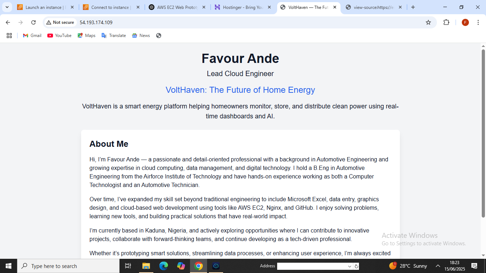

# VoltHaven — The Future of Home Energy ⚡

## 🔧 Description
VoltHaven is a dynamic landing page showcasing a smart energy system prototype. Hosted on AWS EC2 with Nginx, it's a production-ready deployment featuring a personalized UI with Tailwind CSS.

## 👨‍💻 Developer
**Favour Ande**  
Role: Lead Cloud Engineer

## 🌍 Live Demo
**Public IP:** http://<your-ec2-ip>

## 📸 Screenshot

## 🚀 Deployment Steps
1. Launched Ubuntu EC2 instance on AWS.
2. Installed and configured Nginx.
3. Created responsive landing page with Tailwind.
4. Enabled HTTP/HTTPS ports in EC2 security group.
5. (Optional) Configured SSL using Certbot.

## 🔐 Tech Stack
- AWS EC2
- Nginx Web Server
- HTML/CSS (Tailwind)
- Ubuntu 22.04

## 🧰 Future Enhancements
- Contact form (Node.js backend)
- Dark mode toggle
- Analytics integration

